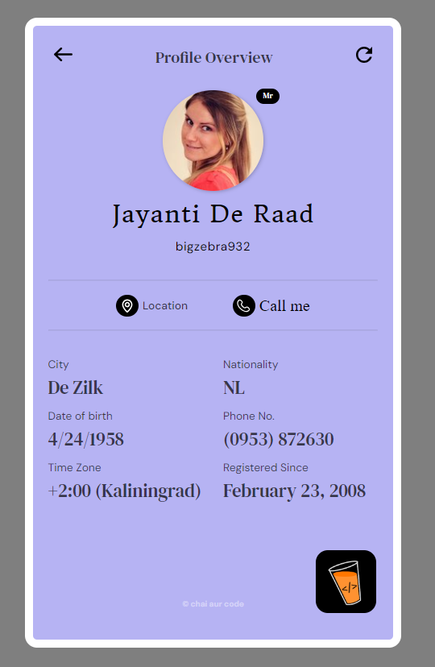
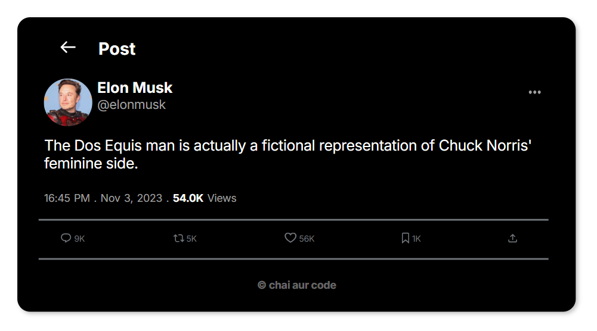
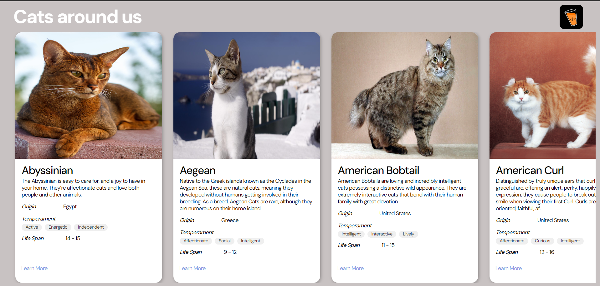

# Machine Coding Round - 2 (React.js)

This React application features three main components:

## Random User Profile: 
Displays random user data with a refresh button and loading state. Hyperlinks for location and call actions open in a new tab, based on the Figma design.

## Random Jokes Tweet:
 Shows jokes with static author details and randomly generated analytics. The tweet card updates with new jokes on page reload.

## Cats Listing:
 Lists cats with horizontal scrolling and pagination. Includes a creative loading state for the cards.

 ## Screenshots

 

## Live Demo

You can check the liive demo [here](https://react-second-assignment.netlify.app).

